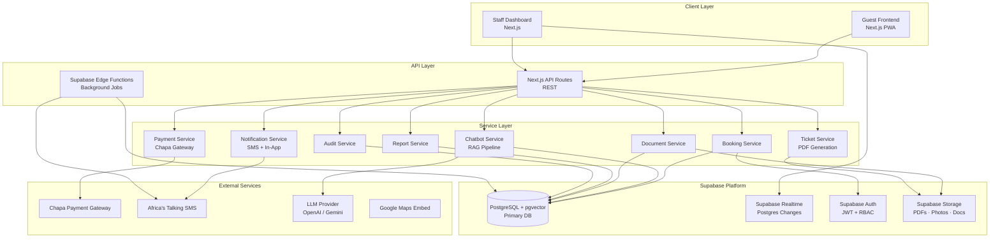
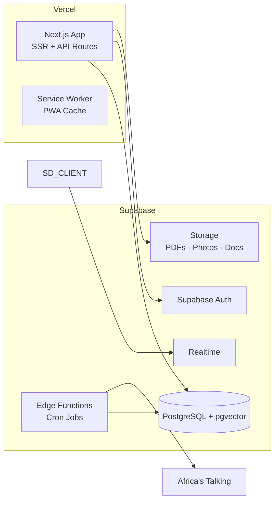
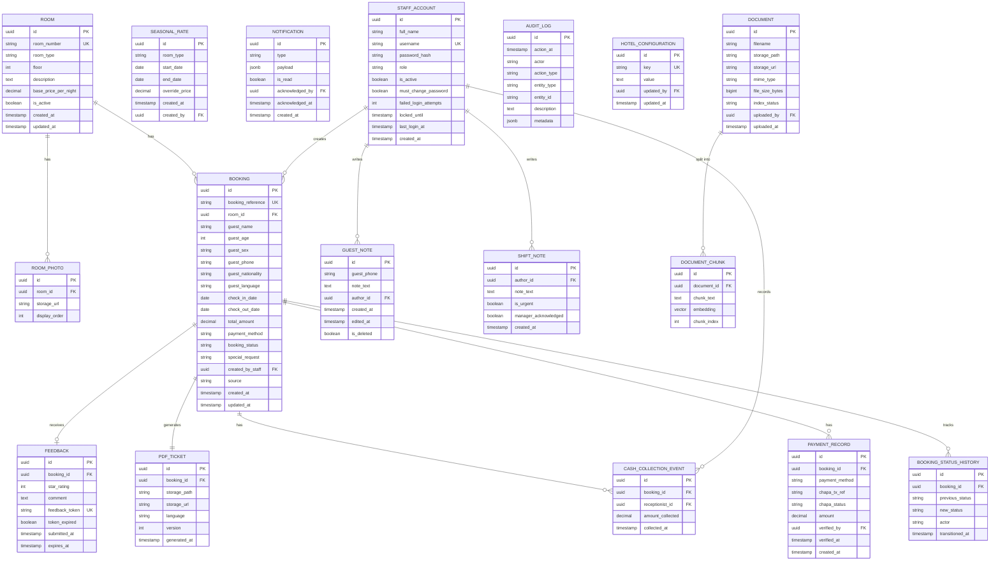
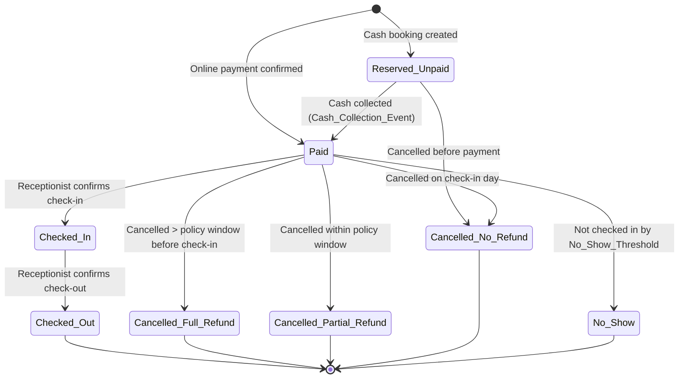

# Design Document: Ras Hotel Management System

## Overview

Ras Hotel Management System is a cloud-based hospitality platform built for a single hotel in Harar, Ethiopia. It replaces paper-based processes with a unified digital system covering online and walk-in bookings, Chapa mobile money payments (TeleBirr, CBE Birr), QR-coded PDF tickets, a RAG-based AI chatbot, real-time room status tracking, housekeeping, shift handover logs, daily revenue reporting, and a multilingual (English, Amharic, Afaan Oromo) Progressive Web Application.

The system is designed around the real operational constraints of the Ethiopian market: intermittent connectivity, cash-dominant payments, multilingual guests, and the need for clear staff accountability at every cash collection and status transition point.

### Key Design Goals

- **Offline-first PWA**: Service Worker caching ensures guests can browse rooms and view bookings on 3G or intermittent connections.
- **Formal booking lifecycle**: A state machine enforces all valid status transitions, preventing invalid states and providing a complete audit trail.
- **Accountability at every cash touch-point**: Every cash collection event is tied to a specific Receptionist's Staff_Account, timestamp, and booking reference.
- **Configurable hotel policies**: Check-in/check-out times, no-show thresholds, and cancellation windows are Manager-configurable without developer intervention.
- **Multilingual by design**: i18n is a first-class concern, not an afterthought — all guest-facing content, SMS messages, and PDF tickets are generated in the guest's selected language.
- **Supabase-first for fast MVP**: Supabase provides the database, auth, real-time subscriptions, and file storage in a single managed platform — eliminating Redis, a separate object store, and a custom WebSocket server from the MVP stack.

---

## Architecture

The system follows a **monorepo, full-stack TypeScript** architecture with a clear separation between the public guest-facing frontend, the staff dashboard frontend, and the backend API. A single PostgreSQL database serves as the source of truth.

### High-Level Architecture



### Technology Stack

| Layer | Technology | Rationale |
|---|---|---|
| Frontend | Next.js 14 (App Router) | SSR for SEO, RSC for performance, built-in PWA support via `next-pwa` |
| Styling | Tailwind CSS + shadcn/ui | Rapid UI development, accessible components |
| Backend | Next.js API Routes (Node.js) | Unified TypeScript codebase, no separate server to manage |
| Database | Supabase (PostgreSQL 15 + pgvector) | ACID transactions, pgvector for RAG embeddings, managed by Supabase |
| DB Client | `@supabase/supabase-js` + raw SQL (via `supabase.rpc`) | Type-safe queries via generated types; complex queries via RPC functions |
| Auth | Supabase Auth | JWT sessions, custom `role` claim (receptionist / manager) for RBAC middleware |
| Real-time | Supabase Realtime (Postgres Changes) | Dashboard live updates via DB-level change events — no Socket.io or Redis needed |
| File Storage | Supabase Storage | PDF tickets, room photos, uploaded documents — S3-compatible, CDN-backed |
| Room Locks | Supabase Edge Function + `pg_advisory_lock` | 10-minute booking hold enforced at the database level |
| Background Jobs | Supabase Edge Functions (cron) | Pre-arrival reminders, no-show escalation, nightly integrity checks |
| PDF Generation | `@react-pdf/renderer` | Server-side PDF with QR code embedding |
| QR Code | `qrcode` npm package | Encoding Booking_Reference into QR |
| SMS | Africa's Talking API | Ethiopian market coverage, Amharic SMS support |
| Payment | Chapa API | TeleBirr + CBE Birr integration |
| LLM (generation) | Gemini 2.5 Flash | Best Amharic + Afaan Oromo coverage among frontier models; 1M token context window; competitive pricing |
| Embeddings | Google `text-embedding-004` (768-dim) | Multilingual, same API provider as LLM (one key), strong African language coverage; stored in pgvector |
| Deployment | Vercel (Next.js) + Supabase (all backend services) | Two managed platforms, zero self-hosted infrastructure |
| i18n | `next-intl` | Server-side translations, locale routing |
| Charts | Recharts | Occupancy and revenue analytics |
| Maps | Google Maps Embed API | Hotel location display |

> **MVP infrastructure footprint:** Vercel + Supabase only. No Redis, no separate vector DB, no separate object store, no custom WebSocket server.

### Deployment Architecture



The staff dashboard subscribes directly to Supabase Realtime channels from the browser client. No intermediary WebSocket server is required.

---

## Components and Interfaces

### 1. Guest Frontend (Public PWA)

**Route structure:**
```
/                          → Hotel landing page (rooms, map, chatbot)
/rooms                     → Room listing with availability calendar
/rooms/[roomId]            → Room detail page
/book/[roomId]             → Booking flow (multi-step)
  /book/[roomId]/details   → Guest registration form
  /book/[roomId]/payment   → Payment selection + Chapa redirect
  /book/[roomId]/confirm   → Booking confirmation + PDF download
/booking/lookup            → Guest booking lookup (ref + phone)
/booking/[ref]/manage      → Booking modification / cancellation
/feedback/[token]          → Post-stay feedback form
/chatbot                   → AI chatbot interface
```

**PWA Configuration:**
- `manifest.json`: name, icons, theme_color, display: standalone
- Service Worker (via `next-pwa`): caches `/`, `/rooms`, `/book/*`, `/booking/lookup`
- Offline fallback page shown when network unavailable

### 2. Staff Dashboard (Authenticated)

**Route structure:**
```
/dashboard                          → Receptionist home (snapshot)
/dashboard/bookings                 → Booking search + list
/dashboard/bookings/new             → Manual booking form
/dashboard/bookings/[id]            → Booking detail + actions
/dashboard/rooms                    → Room status grid
/dashboard/arrivals                 → Today's arrivals
/dashboard/departures               → Today's departures
/dashboard/qr-scan                  → QR scanner interface
/dashboard/shift-notes              → Shift handover log
/dashboard/notifications            → Notification history
/dashboard/guests/[phone]           → Guest profile lookup
/dashboard/reports/revenue          → Revenue summary (Manager)
/dashboard/reports/occupancy        → Occupancy analytics (Manager)
/dashboard/reports/audit            → Audit log (Manager)
/dashboard/reports/feedback         → Guest feedback (Manager)
/dashboard/settings/rooms           → Room management (Manager)
/dashboard/settings/pricing         → Seasonal rates (Manager)
/dashboard/settings/staff           → Staff accounts (Manager)
/dashboard/settings/documents       → Chatbot documents (Manager)
/dashboard/settings/hotel           → Hotel configuration (Manager)
/dashboard/settings/refunds         → Pending refunds (Manager)
```

### 3. API Routes

All API routes are under `/api/v1/`. Authentication is enforced via NextAuth middleware.

| Method | Path | Description | Auth |
|---|---|---|---|
| GET | `/api/v1/rooms` | List available rooms with availability | Public |
| GET | `/api/v1/rooms/[id]` | Room detail | Public |
| POST | `/api/v1/bookings` | Create online booking | Public |
| GET | `/api/v1/bookings/lookup` | Guest booking lookup | Public |
| PATCH | `/api/v1/bookings/[id]` | Modify booking | Guest token / Staff |
| DELETE | `/api/v1/bookings/[id]` | Cancel booking | Guest token / Staff |
| POST | `/api/v1/bookings/[id]/checkin` | Check in | Receptionist+ |
| POST | `/api/v1/bookings/[id]/checkout` | Check out | Receptionist+ |
| POST | `/api/v1/bookings/[id]/extend` | Extend stay | Receptionist+ |
| POST | `/api/v1/bookings/[id]/no-show` | Mark no-show | Receptionist+ |
| POST | `/api/v1/bookings/[id]/cash-payment` | Record cash collection | Receptionist+ |
| GET | `/api/v1/bookings/[id]/ticket` | Download PDF ticket | Public (token) |
| POST | `/api/v1/payments/initiate` | Initiate Chapa payment | Public |
| POST | `/api/v1/payments/webhook` | Chapa webhook callback | Chapa HMAC |
| POST | `/api/v1/payments/[id]/verify` | Manual payment verify | Manager |
| GET | `/api/v1/reports/revenue` | Revenue summary | Manager |
| GET | `/api/v1/reports/occupancy` | Occupancy analytics | Manager |
| GET | `/api/v1/reports/audit` | Audit log | Manager |
| GET | `/api/v1/reports/feedback` | Feedback summary | Manager |
| POST | `/api/v1/chatbot/message` | Send chatbot message | Public |
| POST | `/api/v1/documents` | Upload document | Manager |
| DELETE | `/api/v1/documents/[id]` | Delete document | Manager |
| GET | `/api/v1/staff` | List staff accounts | Manager |
| POST | `/api/v1/staff` | Create staff account | Manager |
| PATCH | `/api/v1/staff/[id]` | Update staff account | Manager |
| GET | `/api/v1/guests/[phone]` | Guest profile | Receptionist+ |
| POST | `/api/v1/guests/[phone]/notes` | Add guest note | Receptionist+ |
| POST | `/api/v1/feedback/[token]` | Submit feedback | Public |
| GET | `/api/v1/config` | Hotel configuration | Public (read) |
| PATCH | `/api/v1/config` | Update hotel configuration | Manager |

### 4. Real-Time Subscriptions (Supabase Realtime)

Staff dashboard clients subscribe to Supabase Realtime channels using the browser-side `@supabase/supabase-js` client after authentication. Subscriptions are scoped to specific tables and filtered by relevant columns.

| Channel | Table / Filter | Payload | Description |
|---|---|---|---|
| `rooms` | `rooms` table — all changes | `{ id, room_number, status, booking_id }` | Room status update |
| `bookings:new` | `bookings` — INSERT | `{ id, guest_name, room_type, check_in_date, booking_reference }` | New online booking |
| `bookings:cancelled` | `bookings` — UPDATE where `booking_status` in cancelled set | `{ id, guest_name, booking_reference }` | Booking cancelled |
| `notifications` | `notifications` — INSERT | `{ id, type, payload, priority }` | New notification alert |
| `shift_notes` | `shift_notes` — INSERT | `{ id, author_id, note_text, is_urgent }` | New shift note |
| `bookings:overdue` | `bookings` — UPDATE where overdue flag set | `{ id, guest_name, guest_phone, room_number }` | Overdue arrival alert |

**Implementation pattern:**
```typescript
// Client-side subscription (staff dashboard)
const channel = supabase
  .channel('room-status')
  .on('postgres_changes', {
    event: 'UPDATE',
    schema: 'public',
    table: 'rooms'
  }, (payload) => {
    updateRoomGrid(payload.new)
  })
  .subscribe()
```

Row-Level Security (RLS) policies on Supabase ensure that only authenticated staff can subscribe to dashboard channels.

---

## Data Models

### Entity Relationship Diagram



### Booking Status State Machine



### Key Database Indexes

```sql
-- Booking lookups
CREATE INDEX idx_bookings_reference ON bookings(booking_reference);
CREATE INDEX idx_bookings_phone ON bookings(guest_phone);
CREATE INDEX idx_bookings_room_dates ON bookings(room_id, check_in_date, check_out_date);
CREATE INDEX idx_bookings_status ON bookings(booking_status);
CREATE INDEX idx_bookings_checkin_date ON bookings(check_in_date);

-- Audit log queries
CREATE INDEX idx_audit_log_actor ON audit_log(actor);
CREATE INDEX idx_audit_log_action_at ON audit_log(action_at DESC);
CREATE INDEX idx_audit_log_entity ON audit_log(entity_type, entity_id);

-- Vector similarity search
CREATE INDEX idx_document_chunks_embedding ON document_chunks
  USING ivfflat (embedding vector_cosine_ops) WITH (lists = 100);

-- Seasonal rates overlap check
CREATE INDEX idx_seasonal_rates_type_dates ON seasonal_rates(room_type, start_date, end_date);
```

---

## Correctness Properties

*A property is a characteristic or behavior that should hold true across all valid executions of a system — essentially, a formal statement about what the system should do. Properties serve as the bridge between human-readable specifications and machine-verifiable correctness guarantees.*

### Property 1: Booking Status Transition Validity

*For any* booking in any valid status, the only permitted next statuses are exactly those defined in the Booking_Lifecycle state machine. Any attempt to transition to a status not in the permitted set SHALL be rejected.

**Validates: Requirements 38.2, 38.3**

### Property 2: No Overlapping Confirmed Bookings for Same Room

*For any* room and any pair of confirmed bookings (status not in {Cancelled_Full_Refund, Cancelled_Partial_Refund, Cancelled_No_Refund, No_Show}) associated with that room, their date ranges SHALL NOT overlap.

**Validates: Requirements 28.1, 28.2**

### Property 3: Room Lock Prevents Double Booking

*For any* room that has an active Room_Lock, no second booking initiation for that room SHALL succeed until the lock expires or is released.

**Validates: Requirements 3.2, 3.3, 3.6**

### Property 4: Cancellation Refund Tier Consistency

*For any* booking cancellation, the refund tier assigned (Full, Partial, or None) SHALL be consistent with the time difference between the cancellation timestamp and the check-in date, as measured against the Hotel_Configuration cancellation policy window.

**Validates: Requirements 16.5, 16.6, 16.7, 34.6**

### Property 5: Cash Collection Accountability

*For any* Cash_Collection_Event, the event SHALL reference exactly one booking, one Receptionist Staff_Account, a positive amount, and a UTC timestamp. No Cash_Collection_Event SHALL exist without all four fields populated.

**Validates: Requirements 31.3, 31.5, 4.9**

### Property 6: Audit Log Completeness

*For any* action of a type listed in Requirement 37.5, an Audit_Log_Entry SHALL exist with the correct actor, action type, entity type, entity identifier, and timestamp. The audit log SHALL be append-only: no entry SHALL be modifiable or deletable.

**Validates: Requirements 37.5, 37.6**

### Property 7: Seasonal Rate Non-Overlap

*For any* room type, no two active Seasonal_Rates SHALL have overlapping date ranges. Any attempt to create a Seasonal_Rate that overlaps an existing one for the same room type SHALL be rejected.

**Validates: Requirements 26.7**

### Property 8: Booking Reference Uniqueness

*For any* two distinct bookings in the system, their Booking_Reference values SHALL be different.

**Validates: Requirements 3.4, 7.1**

### Property 9: PDF Ticket Idempotence

*For any* confirmed booking, regenerating the PDF_Ticket SHALL produce a document with identical booking data (guest name, booking reference, room type, check-in date, check-out date) and a valid, scannable QR code encoding the same Booking_Reference.

**Validates: Requirements 7.6, 7.3**

### Property 10: Booking Lookup Authentication-Free Access

*For any* valid (Booking_Reference, phone number) pair, the guest booking lookup SHALL return the correct booking details without requiring any password or session token. *For any* invalid pair, the system SHALL return an error without revealing which field was incorrect.

**Validates: Requirements 30.2, 30.3**

### Property 11: Terminal Status Immutability

*For any* booking that has reached a terminal status (Checked_Out, Cancelled_Full_Refund, Cancelled_Partial_Refund, Cancelled_No_Refund, No_Show), no further status transition SHALL be permitted.

**Validates: Requirements 38.6**

### Property 12: Multilingual SMS Language Consistency

*For any* booking where the guest selected a non-English language, every SMS sent for that booking (confirmation, check-in instructions, pre-arrival reminder, cancellation, feedback) SHALL be in the guest's selected language.

**Validates: Requirements 29.4, 32.7**

---

## Error Handling

### Payment Failures

- **Chapa webhook timeout**: The system retries webhook processing up to 3 times with exponential backoff. If all retries fail, the booking remains in `Reserved_Unpaid` and a Dashboard alert is raised for manual verification.
- **Duplicate webhook delivery**: Chapa webhooks are idempotent — the system checks the `chapa_tx_ref` before processing. Duplicate events are logged and discarded.
- **Room lock expired before payment confirmed**: The booking is not created. The guest sees a "room no longer available" message and is redirected to room selection.
- **Payment session timeout**: Room lock is released, guest is notified via the UI.

### SMS Delivery Failures

- All SMS sends are wrapped in a retry mechanism (2 attempts, 30-second delay).
- On final failure, a `sms_failure` record is written against the booking and a Dashboard warning is displayed.
- Pre-arrival reminders that fail are logged; a Receptionist can follow up manually.

### Document Indexing Failures

- If the vector embedding pipeline fails for an uploaded document, the document is stored in Supabase Storage but marked `index_status: "failed"` in the database.
- The Manager sees the failed status in the document list and can retry indexing.
- Previously indexed content is preserved on failure.

### Overbooking Detection

- The booking creation endpoint uses a PostgreSQL advisory lock on `(room_id, date_range)` to prevent race conditions.
- A nightly integrity check job scans for any room with two confirmed bookings on overlapping dates and raises a Manager alert.

### Offline / Connectivity

- The Service Worker serves cached guest-facing pages when offline.
- Booking form submissions require network connectivity; the UI shows a clear "You are offline — booking requires an internet connection" message.
- Dashboard Supabase Realtime connections auto-reconnect with exponential backoff on disconnect (handled by the Supabase client library).

### Authentication Errors

- 3 consecutive failed logins → account locked for 15 minutes, staff contact notified. Tracked via `failed_login_attempts` column; Supabase Auth handles JWT issuance.
- Expired JWT sessions → Supabase client auto-refreshes tokens; on hard expiry, redirect to login page with a "session expired" message.
- Deactivated account mid-session → `is_active` check on every API route; next request returns 401 and the Realtime subscription is terminated.

### Validation Errors

- All API endpoints return structured error responses:
```json
{
  "error": {
    "code": "BOOKING_CONFLICT",
    "message": "Room 101 is already reserved from 2025-08-10 to 2025-08-12 (Booking REF-00123)",
    "details": { "conflictingBookingRef": "REF-00123", "conflictDates": ["2025-08-10", "2025-08-11"] }
  }
}
```
- Ethiopian phone number validation: regex `^(\+251|0)(9|7)\d{8}$`
- Date range validation: check-out must be strictly after check-in.
- Hotel configuration: check-out time must be strictly before check-in time.

---

## Testing Strategy

### Unit Tests (Jest + Testing Library)

Unit tests cover pure business logic functions with specific examples and edge cases:

- Booking status transition validator (valid and invalid transitions)
- Cancellation refund tier calculator (boundary conditions: exactly at policy window, 1 minute before/after)
- Ethiopian phone number validator (valid formats, invalid formats, edge cases)
- Seasonal rate overlap detector
- Occupancy rate calculator
- Room lock TTL logic
- PDF ticket data assembly
- i18n message formatter

### Property-Based Tests (fast-check)

Each property test runs a minimum of 100 iterations. Tests are tagged with the design property they validate.

**Feature: ras-hotel-management, Property 1: Booking Status Transition Validity**
- Generate random (currentStatus, attemptedNextStatus) pairs
- Assert: only permitted transitions return success; all others return rejection with current status and valid next statuses

**Feature: ras-hotel-management, Property 2: No Overlapping Confirmed Bookings**
- Generate random sets of bookings for the same room with varying date ranges and statuses
- Assert: the overlap check function correctly identifies all overlapping confirmed booking pairs

**Feature: ras-hotel-management, Property 4: Cancellation Refund Tier Consistency**
- Generate random (cancellationTimestamp, checkInDate, policyWindowHours) triples
- Assert: the refund tier returned matches the expected tier based on the time difference

**Feature: ras-hotel-management, Property 5: Cash Collection Accountability**
- Generate random Cash_Collection_Event inputs (valid and invalid)
- Assert: events with missing bookingId, receptionistId, amount ≤ 0, or missing timestamp are rejected

**Feature: ras-hotel-management, Property 7: Seasonal Rate Non-Overlap**
- Generate random sets of seasonal rates for the same room type
- Assert: the overlap validator correctly identifies all conflicting rate pairs

**Feature: ras-hotel-management, Property 8: Booking Reference Uniqueness**
- Generate N booking references using the reference generator
- Assert: all N references are distinct (no duplicates in any batch)

**Feature: ras-hotel-management, Property 9: PDF Ticket Idempotence**
- Generate random confirmed booking data
- Assert: calling the PDF data assembler twice with the same input produces identical output

**Feature: ras-hotel-management, Property 11: Terminal Status Immutability**
- Generate random terminal statuses and attempted transitions
- Assert: all transition attempts on terminal statuses are rejected

**Feature: ras-hotel-management, Property 12: Multilingual SMS Language Consistency**
- Generate random booking records with non-English language selections
- Assert: the SMS template selector always returns a template in the booking's language

### Integration Tests (Vitest + Supertest)

Integration tests run against a local Supabase instance (`supabase start`) which spins up a full Postgres + Auth + Storage stack locally via Docker:

- Full booking creation flow (online payment path)
- Full booking creation flow (cash payment path)
- Chapa webhook processing (success, failure, duplicate)
- Room lock creation, expiry, and release (via `pg_advisory_lock`)
- Check-in and check-out flows with status history recording
- Booking cancellation with correct refund tier assignment
- Staff authentication, session management, and RBAC enforcement (Supabase Auth + RLS)
- Audit log entry creation for all action types in Requirement 37.5
- Seasonal rate application during booking price calculation
- No-show escalation at configured threshold time
- Pre-arrival reminder scheduling and cancellation on booking modification
- Supabase Storage upload and signed URL generation for PDF tickets

### End-to-End Tests (Playwright)

E2E tests cover the primary guest and staff workflows:

- Guest: browse rooms → book → pay via Chapa (mocked) → download PDF ticket
- Guest: look up booking by reference + phone number
- Guest: cancel booking and receive SMS confirmation
- Receptionist: log in → scan QR code → check in guest
- Receptionist: create manual booking → record cash payment
- Receptionist: write shift note → incoming receptionist sees it on home screen
- Manager: view revenue summary → export CSV
- Manager: upload chatbot document → verify indexing status
- Manager: configure hotel settings → verify SMS uses new values

### Performance Targets

| Metric | Target |
|---|---|
| Initial page load (3G) | < 3 seconds |
| Booking confirmation screen | < 2 seconds after payment |
| PDF ticket generation | < 3 seconds |
| QR scan to booking display | < 2 seconds |
| Dashboard room status update | < 5 seconds |
| Analytics report (90-day range) | < 10 seconds |
| Google Lighthouse PWA score | ≥ 90 |
| Google Lighthouse mobile performance | ≥ 70 |

### Security Testing

- OWASP Top 10 review for all API endpoints
- SQL injection prevention via Prisma parameterized queries
- CSRF protection on all state-changing endpoints
- Rate limiting on authentication endpoints (10 req/min per IP)
- Chapa webhook signature verification (HMAC-SHA256)
- Input sanitization for all free-text fields (XSS prevention)
- HTTPS enforced on all routes (HSTS header)